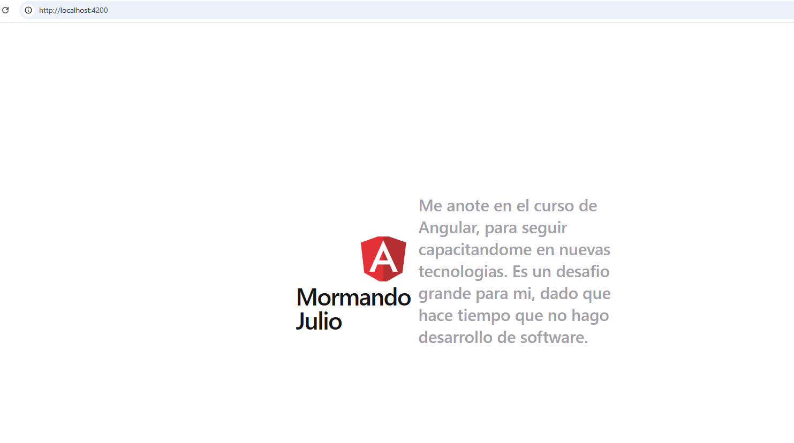
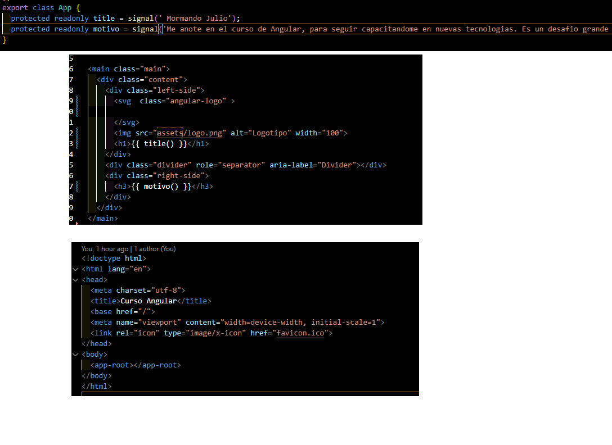

# Mi Primera App en Angular

## Descripción del proyecto

Este proyecto fue desarrollado como parte del curso de Angular, correspondiente al Módulo 1 - Unidad 1.

El objetivo de la actividad fue comprender el flujo básico de trabajo en Angular utilizando Angular CLI, explorando la estructura principal del proyecto, modificando componentes y aplicando código de variables en la vista.

La aplicación incluye:
- Cambio del título principal.
- Información personal del estudiante.
- Uso de código de datos.
- Inclusión de imágenes mediante la carpeta assets.

---

# Tecnologías utilizadas

- Angular
- TypeScript
- HTML
- CSS
- Node.js
- Angular CLI

---

# Creación del proyecto

El proyecto fue generado utilizando Angular CLI con el siguiente comando:

```bash
ng new unidad1
```

Luego se ejecutó con:

```bash
ng serve
```

La aplicación se visualiza en:

```bash
http://localhost:4200/
```

---

# Estructura principal del proyecto

## src/app

Carpeta principal donde se encuentran los componentes de la aplicación.

## app.component.ts

Archivo TypeScript del componente principal.  
Aquí se definen variables, lógica y comportamiento del componente.

## app.component.html

Plantilla HTML del componente principal.  
Contiene el contenido visual mostrado en pantalla.

## app.module.ts

Módulo principal de Angular donde se registran componentes y módulos utilizados por la aplicación.

## assets/

Carpeta utilizada para almacenar recursos estáticos como imágenes, íconos y archivos adicionales.

## environments/

Carpeta que contiene configuraciones para distintos entornos, por ejemplo desarrollo y producción.

---

# Modificaciones realizadas

Se realizaron las siguientes modificaciones solicitadas en la consigna:

- Cambio del título principal de la aplicación.
- Agregado de un párrafo con información personal.
- Creación de variables en el componente.
- Uso de interpolación en la plantilla HTML.
- Inclusión de una imagen desde la carpeta assets.

---

# Ejemplo de interpolación

En el archivo `app.component.ts` se creó una variable:

```typescript
title = 'Mormando Julio';
motivo = 'Me anote en el curso de Angular, para seguir capacitandome en nuevas tecnologias. Es un desafio grande para mi, dado que hace tiempo que no hago desarrollo de software.';
```

Luego se mostró en la vista utilizando interpolación:

```html
<h1>{{ title }}</h1>
<h3>{{ motivo }}</h3>
```

---

# Capturas de pantalla

## Pantalla principal de la aplicación



## Ejemplo de interpolación funcionando



---

# Instrucciones para ejecutar el proyecto

## 1. Clonar el repositorio

```bash
git clone URL_DEL_REPOSITORIO
```

## 2. Ingresar al proyecto

```bash
cd unidad1
```

## 3. Instalar dependencias

```bash
npm install
```

## 4. Ejecutar la aplicación

```bash
ng serve
```

## 5. Abrir en el navegador

```bash
http://localhost:4200/
```

---

# Autor

- Nombre: MORMANDO JULIO
- Curso: Angular
- Unidad: Módulo 1 - Unidad 1
- Institución: CGP

---

# Bibliografía y fuentes

## Documentación oficial

- Angular. Welcome to the Angular tutorial.  
  https://angular.dev/tutorials/learn-angular

- Angular CLI.  
  https://angular.dev/tools/cli

- Anatomy of a component.  
  https://angular.dev/guide/components

## Libro

- Freeman, A. Pro Angular 9. 6ª ed. Apress; 2020.

---

# Observaciones

Proyecto desarrollado con fines educativos para la práctica inicial de Angular y Angular CLI.